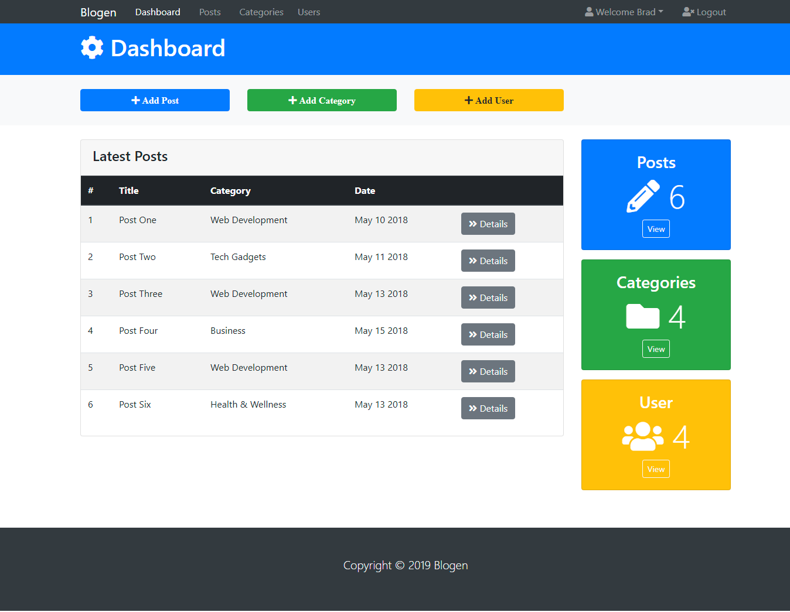

# blogen
Dashboard to a Blog

# Udemy Blogen Project
This project is for learning purpose using Bootstrap 4.
Blogen is a responsive multi-page theme, a dashboard to a blog admin area UI.

## Components
- Dropdown menu
- Sections connected to modal
- Form, radio buttons
- Boxes
- Tables

## Screenshot of the page

## External Resources Used
This site was built using:
- [Bootstrap](https://getbootstrap.com/)
- [Font Awesome](https://fontawesome.com/)
